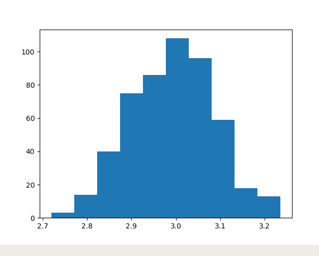

# 快速入门
## 数据准备
faiss可以处理固定维度d的向量集合，这样的集合这里用二维数组表示。 一般来说，我们需要两个数组：

1.data 数据集合

2.index 索引向量，我们需要根据索引向量的值返回xb中的最近邻元素。

以下三组代码使用相同的数据（512维，data包含2000个向量，每个向量符合正态分布）来演示几种基础索引
```
import numpy as np 
d = 512          #维数
n_data = 2000   
np.random.seed(0) 
data = []
mu = 3
sigma = 0.1
for i in range(n_data):
    data.append(np.random.normal(mu, sigma, d))
data = np.array(data).astype('float32')

# print(data[0])

# 查看第六个向量是不是符合正态分布
import matplotlib.pyplot as plt 
plt.hist(data[5])
plt.show()
```



```
query = []
n_query = 10
mu = 3
sigma = 0.1
np.random.seed(12) 
query = []
for i in range(n_query):
    query.append(np.random.normal(mu, sigma, d))
query = np.array(query).astype('float32')
```


## 精确索引

在使用faiss时，我们是围绕index对象进行的。index中包含被索引的数据库向量，在索引时可以选择不同方式的预处理来提高索引的效率，表现维不同的索引类型。在精确搜索时选择最简单的IndexFlatL2索引类型。
IndexFlatL2类型遍历计算查询向量与被查询向量的L2精确距离，不需要训练操作（大部分index类型都需要train操作）。精确索引通过暴力比较遍历出TopK。

在构建index时要提供相关参数，这里是向量维数d，构建完成index之后可以通过add()和search（）进行查询。
```
import faiss
index = faiss.IndexFlatL2(d)  # 构建 IndexFlatL2
print(index.is_trained)  # False时需要train
index.add(data)  #添加数据
print(index.ntotal)  #index中向量的个数
```
输出：
```
True
2000
```

```
#精确索引无需训练便可直接查询
k = 10  # 返回结果个数
query_self = data[:5]  # 查询本身
dis, ind = index.search(query_self, k)
print(dis.shape) # 打印张量 (5, 10)
print(ind.shape) # 打印张量 (5, 10)
print(dis)  # 升序返回每个查询向量的距离
print(ind)  # 升序返回每个查询向量67 8.628234
  8.709978 8.77004 ]个相似结果的数组位置
```
输出：
```
(5, 10)
(5, 10)
[[0.       8.007045 8.313328 8.53567 8.628234
  8.709978 8.77004 ] 8.560175 8.561642 8.624167 8.6282367 8.628234
  8.709978 8.77004 ]
  8.709978 8.77004 ]
 [0.       8.27809  8.355579 8.42606  8.462017 8.468868 8.487028 8.549963
  8.562824 8.599199]
 [0.       8.152368 8.156569 8.223303 8.276016 8.376871 8.379269 8.406122
  8.418619 8.443283]
 [0.       8.260519 8.336826 8.339298 8.40288  8.46439  8.474661 8.479043
  8.485248 8.526599]
 [0.       8.346273 8.407202 8.462828 8.49723  8.520801 8.597084 8.600386
  8.605133 8.630594]]
[[   0  798  879  223  981 1401 1458 1174  919   26]
 [   1  981 1524 1639 1949 1472 1162  923  840  300]
 [   2 1886  375 1351  518 1735 1551 1958  390 1695]
 [   3 1459  331  389  655 1943 1483 1723 1672 1859]
 [   4   13  715 1470  608  459  888  850 1080 1654]]
 ```

```
k = 10
dis, ind = index.search(query, k)
print(dis)
print(ind)
```


## 倒排表快速索引
在数据量非常大的时候，需要对数据做预处理来提高索引效率。一种方式是对数据库向量进行分割，划分为多个d维维诺空间，查询阶段，只需要将查询向量落入的维诺空间中的数据库向量与之比较，返回计算所得的k个最近邻结果即可，大大缩减了索引时间。
nlist参数控制将数据集向量分为多少个维诺空间；
nprobe参数控制在多少个维诺空间的范围内进行索引。
```
nlist = 50  # 将数据库向量分割为多少了维诺空间
k = 10
quantizer = faiss.IndexFlatL2(d)  # 量化器
index = faiss.IndexIVFFlat(quantizer, d, nlist, faiss.METRIC_L2)
       # METRIC_L2计算L2距离, 或faiss.METRIC_INNER_PRODUCT计算内积
assert not index.is_trained   #倒排表索引类型需要训练
index.train(data)  # 训练数据集应该与数据库数据集同分布
assert index.is_trained

index.add(data)
index.nprobe = 50  # 选择n个维诺空间进行索引,
dis, ind = index.search(query, k)
print(dis)
print(ind)
```
通过改变nprobe的值，发现在nprobe值较小的时候，查询可能会出错，但时间开销很小，随着nprobe的值增加，精度逐渐增大，但时间开销也逐渐增加，当nprobe=nlist时，等效于IndexFlatL2索引类型。
简而言之，倒排表索引首先将数据库向量通过聚类方法分割成若干子类，每个子类用类中心表示，当查询向量来临，选择距离最近的类中心，然后在子类中应用精确查询方法，通过增加相邻的子类个数提高索引的精确度。
## 乘积量化索引
在上述两种索引方式中，在index中都保存了完整的数据库向量，在数据量非常大的时候会占用太多内存，甚至超出内存限制。
在faiss中，当数据量非常大的时候，一般采用乘积量化方法保存原始向量的有损压缩形式,故而查询阶段返回的结果也是近似的。
```
nlist = 50
m = 8  # 列方向划分个数，必须能被d整除
k = 10
quantizer = faiss.IndexFlatL2(d)  
index = faiss.IndexIVFPQ(quantizer, d, nlist, m, 8) # 8 表示每个子向量被编码为 8 bits
index.train(data)
index.add(data)
index.nprobe = 50
dis, ind = index.search(query_self, k)  # 查询自身
print(dis)
print(ind)
dis, ind = index.search(query, k)  # 真实查询
print(dis)
print(ind)
```
输出：
```
[[4.8332453 4.916275  5.0142426 5.0211687 5.0282335 5.039744  5.063374
  5.0652556 5.065288  5.0683947]
 [4.456933  4.6813188 4.698038  4.709836  4.72171   4.7280436 4.728564
  4.728917  4.7406554 4.752378 ]
 [4.3990726 4.554667  4.622962  4.6567664 4.665245  4.700697  4.7056646
  4.715714  4.7222314 4.7242   ]
 [4.4063187 4.659938  4.719548  4.7234855 4.727058  4.7630377 4.767138
  4.770565  4.7718883 4.7720337]
 [4.5876865 4.702366  4.7323933 4.7387223 4.7550535 4.7652235 4.7820272
  4.788397  4.792813  4.7930083]]
[[   0 1036 1552  517 1686 1666    9 1798  451 1550]
 [   1  725  270 1964  430  511  598   20  583  728]
 [   2  761 1254  928 1913 1886  400  360 1850 1840]
 [   3 1035 1259 1884  584 1802 1337 1244 1472  468]
 [   4 1557  350  233 1545 1084 1979 1537  665 1432]]
[[5.184828  5.1985765 5.2006407 5.202751  5.209732  5.2114754 5.2203827
  5.22132   5.2252693 5.2286644]
 [5.478416  5.5195136 5.532296  5.563965  5.564443  5.5696826 5.586555
  5.5897493 5.59312   5.5942397]
 [4.7446747 4.8150816 4.824335  4.834736  4.83847   4.844829  4.850663
  4.853364  4.856619  4.865398 ]
 [4.733185  4.7483554 4.7688575 4.783175  4.785554  4.7890463 4.7939577
  4.797909  4.8015175 4.802591 ]
 [5.1260395 5.1264906 5.134188  5.1386065 5.141901  5.148476  5.1756086
  5.1886897 5.192538  5.1938267]
 [4.882325  4.900981  4.9040375 4.911916  4.916094  4.923492  4.928433
  4.928472  4.937878  4.9518585]
 [4.9729834 4.976016  4.984484  5.0074816 5.015956  5.0174923 5.0200887
  5.0217285 5.028976  5.029479 ]
 [5.064405  5.0903125 5.0971365 5.098599  5.108646  5.113497  5.1155915
  5.1244674 5.1263866 5.129635 ]
 [5.060173  5.0623484 5.075763  5.087064  5.100909  5.1075807 5.109309
  5.110051  5.1323767 5.1330123]
 [5.12455   5.149974  5.151128  5.163775  5.1637926 5.1726117 5.1732545
  5.1762547 5.1780767 5.185327 ]]
[[1264  666   99 1525 1962 1228  366  268  358 1509]
 [ 520  797 1973  365 1545 1032 1077   71  763  753]
 [1632  689 1315  321  459 1486  818 1094  378 1479]
 [ 721 1837  537 1741 1627  154 1557  880  539 1784]
 [1772  750 1166 1799  572  997  340  127  756  375]
 [1738 1978  724  749  816 1046 1402  444 1955  246]
 [1457 1488 1902 1187 1485  986   32  531   56  913]
 [1488 1244  121 1144 1280 1078 1012 1215 1639 1175]
 [ 426   45  122 1239  300 1290  546  505 1687  434]
 [ 263  343 1025  583 1489  356 1570 1282  627 1432]]
```
乘积量化后查询返回的距离值与真实值相比偏小，返回的结果只是近似值。
查询自身时能够返回自身，但真实查询时效果较差，这里只是使用了正态分布的数据集，在真实使用时效果会更好，原因有：
1.正态分布的数据相对更难查询，难以聚类/降维；
2.自然数据相似的向量与不相似的向量差别更大，更容易查找；