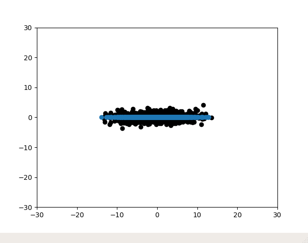
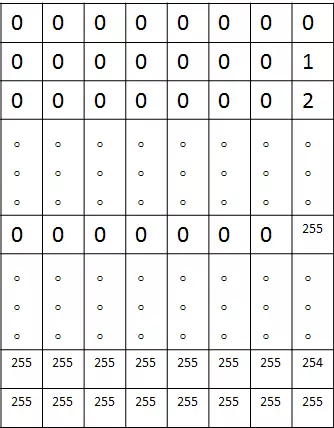
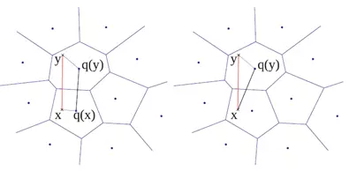

# faiss基础模块

faiss中的索引基于几个基础算法构建，只不过在faiss中是一种高效的实现。他们分别是k-means聚类、PCA降维、PQ编码、解码

## k-means聚类
```
import sys
import faiss

#数据
import numpy as np 
d = 512          #维数
n_data = 2000   
np.random.seed(0) 
data = []
mu = 3
sigma = 0.1
for i in range(n_data):
    data.append(np.random.normal(mu, sigma, d))
data = np.array(data).astype('float32')

# 聚类
ncentroids = 10 # 类中心有
d = data.shape][1 # 512
kmeans = faiss.Kmeans(d, ncentroids)
kmeans.verbose = True
kmeans.niter = 20
kmeans.train(data)

#输出数据维度
print(kmeans.d) # 512
#输出聚类中心
print(kmeans.centroids.shape) #[10,512]
print(kmeans.centroids)
```
输出：
```
512
512
(10, 512)
[[3.0133038 3.0068104 3.0045269 ... 3.0012732 2.9967926 2.9840543]
 [2.9861262 3.00252   3.0041847 ... 2.9930105 2.998929  2.9944859]
 [2.9998899 3.0016983 2.9963124 ... 3.0260603 2.999532  3.0100884]
 ...
 [2.9905105 3.0113528 2.9998093 ... 2.9874244 3.0264816 2.9878159]
 [3.0122757 2.9936473 2.9966793 ... 2.9819887 2.9963892 2.992456 ]
 [2.9659038 2.9428425 3.0470734 ... 2.9753938 2.984248  3.0704408]]
#计算某个向量属于哪一个子类，返回聚类中心次序和L2距离
[[5.0206504]
 [4.7416644]
 [4.740188 ]
 [4.76837  ]
 [4.7409596]]
[[8]
 [1]
 [0]
 [5]
 [5]]
返回距离某个聚类中心最近的5个向量
[[4.1682515 4.2003937 4.2832212 4.295815  4.319538 ]
 [4.2491074 4.293486  4.374477  4.3974423 4.4104514]
 [4.14694   4.191353  4.2929344 4.3046827 4.3229265]
 [4.287328  4.345145  4.377757  4.388964  4.3992624]
 [4.269099  4.4400415 4.485525  4.5497375 4.552755 ]
 [4.2090874 4.233218  4.2762814 4.282202  4.3601437]
 [4.2276707 4.358526  4.3603854 4.3776894 4.402213 ]
 [4.286249  4.2988906 4.3401113 4.351864  4.3682466]
 [4.2735186 4.284013  4.3029184 4.3057995 4.3093643]
 [4.043633  4.0906057 4.336546  4.384033  4.424797 ]]
[[1083  981  106  277  879]
 [ 981  277 1417  879  198]
 [ 981 1624   28 1686 1384]
 [ 981  685 1624  879  121]
 [ 867  625 1401  519 1483]
 [ 981  277  879 1624 1023]
 [ 981  879 1624  145  389]
 [ 981  879 1417  277  519]
 [ 145  981  277  879 1801]
 [1011  835  148  744 1699]]
```
```
多GPU聚类案例官方案例
https://github.com/facebookresearch/faiss/blob/master/benchs/kmeans_mnist.py
```

## PCA降维度
```
import numpy as np
import matplotlib.pyplot as plt

N = 1000

x = 5*np.random.randn(N)
y = np.random.randn(N)
plt.scatter(x, y,color='black')

data = []
for i in range(N):
    data.append([x[i],y[i]])

data = np.array(data).astype('float32')

import faiss
mat = faiss.PCAMatrix (2, 1) #２维降到一维
mat.train(data)
assert mat.is_trained
tr = mat.apply_py(data)
print(tr.shape)

out_x = []
out_y = []
for i in range(N):
    out_x.append(tr[i][0])
    out_y.append(0)
plt.scatter(out_x,out_y)

plt.xlim((-30, 30))
plt.ylim((-30, 30))
plt.show()
```



## PQ编码/解码
ProductQuantizer 对象可以将向量编码为code
### ProductQuantizer简介
Product Quantizer是由Herv´e J´egou等人2011年在IEEEE上发表的论文《Product Quantization for Nearest Neighbor Search》中提出来的。它的提出是为了在内存和效率之间求得一个平衡，既保证图像索引结构需要的内存足够，又使得检索质量和速度比较好。对于任何基于固定维数特征的事物，它可以应用到其索引结构的建立及检索上。它属于ANN(approximate nearest neighbor)算法。与它相关的算法有E2LSH（Euclidean Locality-Sensitive Hashing）,KD-trees,K-means.
#### 空间切分
首先，PQ先将D维空间切分成M份：即将128维空间切分成M个D/M维的子空间，如下图所示M=8（在原文中，作者由于是在PCA之后进行的PQ检索，所以进行了一个随机旋转，因为PCA之后特征值的顺序是按照从大到小排列的）


用代码表示就是把向量维度切分：
```
# vtrain的转置是原始128维向量，vs是其中的一个子向量
int ds= d / nsq; for ( int i = 0; i < nsq; i ++ )
{ for ( int j = 0; j < ds; j ++ )
    {
        vs.push_back( vtrain.row( i*ds + j ) );
    }
} 
```
#### 量化
这样就可以在每个子空间内都会有1M个短向量，我们为每个子空间单独训练一本码书，图中码书规模为k=256，维度d=D/M=128/8=16，代码只要在上面的外循环中添加k-means聚类即可。
　　到这里我们就有M=8本子码书，下面我们依次量化每个子空间的数据，量化的过程就是计算每个短向量距离最近的聚类中心，距离就是L2距离。

#### 压缩
现在考虑一个D=128维的原始向量，它被切分成了M=8个d=16维的短向量，同时每个短向量都对应一个量化的索引值，索引值即该短向量距离最近的聚类中心的编号，每一个原始向量就可以压缩成M个索引值构成的压缩向量，只要设计好了数据结构，就可以获得所有1M数据的压缩向量。压缩向量其实就是M个索引值，每个索引值对应一个聚类中心，所以要同时保存压缩向量和聚类中心。
其实一个向量被8个索引值同时索引，而如果把这8个索引值转换成一个的话是多大呢，k的M次方，这里应该是256的8次方，这是一个很大很大的数，而上面的操作就等效于生成了一个这么大规模的码书。为什么这么说呢，因为每一个短向量（或称子向量）量化的过程都有k个选择，而一个原始向量有M个选择，类似于8位256进制的数可以表示的最大数值：


对于query图像的原始向量也经过上述流程的切分和量化过程，最后生成同样的M维压缩向量
#### 距离计算
对于训练数据和测试数据都压缩完成后，接下来就是讨论如何计算两个压缩向量之间的距离呢？而且是快速的计算。
作者提供了两种距离计算方式，分别为 “对称距离计算” 和 “非对称距离计算” ，分别如下左右图所示：



对称距离计算：直接使用两个压缩向量x，y的索引值所对应的码字q(x),q(y)之间的距离代替之，而q(x),q(y)之间的距离可以离线计算，因此可以把q(x),q(y)之间的距离制作成查找表，只要按照压缩向量的索引值进行对应的查找就可以了，所以速度非常快；
非对称距离计算：使用x，q(y)之间的距离代替x，y之间的距离，其中x是测试向量。虽然y的个数可能有上百万个，但是q(y)的个数只有k个，对于每个x，我们只需要在输入x之后先计算一遍x和k个q(y)的距离，制成查找表（因为只有k个，所以速度是非常快的），然后按照y对应的压缩向量索引值进行取值操作就可以了。

案例：
```
import sys
import faiss

#数据
import numpy as np 
d = 512          #维数
n_data = 2048   
np.random.seed(0) 
data = []
mu = 3
sigma = 0.1
for i in range(n_data):
    data.append(np.random.normal(mu, sigma, d))
data = np.array(data).astype('float32')

d = 512  # 数据维度
cs = 8  # code size (bytes)

# 训练数据集
xt = data  #训练集
# dataset to encode (could be same as train)
x = data
pq = faiss.ProductQuantizer(d, cs, 8)
pq.ksub = 32 # 修改 centroids
pq.train(xt)
# pq.add(xt)
# pq.search(data[:5])

print(d)
# encode编码 
codes = pq.compute_codes(x)
# decode解码
x2 = pq.decode(codes)
# 编码-解码后与原始数据的差
avg_relative_error = ((x - x2)**2).sum() / (x ** 2).sum()
print(avg_relative_error)
```


```
import sys
import faiss

#数据
import numpy as np 
d = 512          #维数
n_data = 2048   
np.random.seed(0) 
data = []
mu = 3
sigma = 0.1
for i in range(n_data):
    data.append(np.random.normal(mu, sigma, d))
data = np.array(data).astype('float32')


d = 512  # 数据维度
# 训练集
xt = data
# dataset to encode (could be same as train)
x = data
# QT_8bit allocates 8 bits per dimension (QT_4bit also works)
sq = faiss.ScalarQuantizer(d, faiss.ScalarQuantizer.QT_8bit)
sq.train(xt)
# encode 编码
codes = sq.compute_codes(x)
# decode 解码
x2 = sq.decode(codes)
# 计算编码-解码后与原始数据的差
avg_relative_error = ((x - x2)**2).sum() / (x ** 2).sum()
print(avg_relative_error) # 6.746683e-08
```