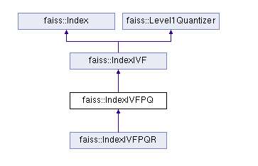

# faiss ivfpq文件格式解析

## ivfpq cpu版本类图


## 文件布局
```
 -------------
|             |
|    magic    |
|    number   |
|             |
|-------------|
|             |　　　　　　　　　　　　－－－－－－－－－－－－－－－－－－－－－－－－－－－－－－
|             |                   |　　　　｜　　　　｜　　　　｜　　　　｜　　　　 ｜　　　　｜　　
|    ivf      |------------------>|　 D   ｜ ntotal|　dummy｜dummy  ｜trained | type　｜
|    header   |                   |　　　　｜　　　　｜　　　　｜　　　　｜　　 　　｜　　　　｜　　
|             |　　　　　　　　　　　　－－－－－－－－－－－－－－－－－－－－－－－－－－－－－－
 -------------
|             |
|    nlist    |
|             |
 -------------
|             |
|   nprobe    |
|             |
 -------------
|             |　　　　　　　　　　　 ---------
|             |                   |　IxF2 ｜　　
|  IVF        |------------------>------------------------------------------------
|  quantizer  |                   | 　D   ｜ ntotal |dummy |dummy ｜trained | type | 　
|             |　　　　　　　　　　　 ------------------------------------------------
|             |                   |xb.size| xb.data| direct | direct_map |   
|             |　                  ---------------------------------------
 -------------
|             |
|  residual   |
|             |
 -------------
|             |
| code_size   |
|             |
 -------------
|             |　　　　　　　　　　　 -------------------------
|             |                   |　 D   ｜ M     | nbits ｜　　　
|  Product    |------------------>|------------------------------------
|  Quantizer  |                   | centroids.size |　centroids.data() |
|             |　　　　　　　　　　　 -------------------------------------
 -------------
|             |　　　　　　　　　　　 ---------------------------
|             |                   | ilar | nlist | code_size |
|  Inverted   |------------------>----------------------------------------
|  List       |                   | full ｜ ids_list.size |ids_list.data |
|             |　　　　　　　　　　　 ----------------------------------------
|             |                   |codes| ids|
|             |　                  -----------
|             |                   |codes| ids|
|             |　                  -----------
 -------------                     .........
```
## 测试条件
```
样本总量 1024 * 1024 * 2
维度256
PQ成32段
每个code固定量化空间是256个，即nbits=8
nlist 1
生成文件大小 84149436 字节
```

## ivfpq write-to-file 代码段
index_io.cpp
```
else if(const IndexIVFPQ * ivpq =
              dynamic_cast<const IndexIVFPQ *> (idx)) {
        const IndexIVFPQR * ivfpqr = dynamic_cast<const IndexIVFPQR *> (idx);

        uint32_t h = fourcc (ivfpqr ? "IwQR" : "IwPQ");
        WRITE1 (h);
        write_ivf_header (ivpq, f);
        WRITE1 (ivpq->by_residual);
        WRITE1 (ivpq->code_size);
        write_ProductQuantizer (&ivpq->pq, f);
        write_InvertedLists (ivpq->invlists, f);
        if (ivfpqr) {
            write_ProductQuantizer (&ivfpqr->refine_pq, f);
            WRITEVECTOR (ivfpqr->refine_codes);
            WRITE1 (ivfpqr->k_factor);
        }

    }
```

## magic number
faiss　不同版本之间　magic number略有差异
```
uint32_t h = fourcc (ivfpqr ? "IwQR" : "IwPQ");
WRITE1 (h);
```

文件偏移　0-3字节
```
49 76 50 51　　　　IwPQ
```

## ivf倒排信息
```
write_ivf_header (ivpq, f);
```

具体代码实现
```
static void write_ivf_header (const IndexIVF *ivf, IOWriter *f) {
    write_index_header (ivf, f);
    WRITE1 (ivf->nlist);
    WRITE1 (ivf->nprobe);
    write_index (ivf->quantizer, f);
    WRITE1 (ivf->maintain_direct_map);
    WRITEVECTOR (ivf->direct_map);
}

```
### 写入 write_index_header
```
static void write_index_header (const Index *idx, IOWriter *f) {
    WRITE1 (idx->d);　　　　　# int 数据维度　256
    WRITE1 (idx->ntotal);   # int 向量总数　1024 * 1024 * 2
    Index::idx_t dummy = 1 << 20;  
    WRITE1 (dummy);         # int64 1 << 20
    WRITE1 (dummy);         # int64 1 << 20
    WRITE1 (idx->is_trained);  # bool 必为true
    WRITE1 (idx->metric_type);  #类型：enum MetricType 值：METRIC_L2 即 1
} 
```
文件偏移　索引文件偏移 4-36
```
0x04~0x07  00 01 00 00                    #256  little-endian
0x08~0x15  00 00 20 00 00 00 00 00        #1024*1024*2 little-endian
0x16~0x23  00 00 10 00 00 00 00 00        
0x24~0x31  00 00 10 00 00 00 00 00
0x32~0x32  01                             #1
0x33~0x36  01 00 00 00                    #1 little-endian
```
### 写入 nlist 和npobe
```
WRITE1 (ivf->nlist);  # 8字节 1024
WRITE1 (ivf->nprobe);
```
索引文件偏移37～52

```
01 00 00 00 00 00 00 00  # little-endian 1
00 01 00 00 00 00 00 00  # little-endian 256

```

## 写入粗聚类中心
```
write_index (ivf->quantizer, f);

if (const IndexFlat * idxf = dynamic_cast<const IndexFlat *> (idx)) {
    uint32_t h = fourcc (
            idxf->metric_type == METRIC_INNER_PRODUCT ? "IxFI" :
            idxf->metric_type == METRIC_L2 ? "IxF2" : nullptr);
    WRITE1 (h);
    write_index_header (idx, f);
    WRITEVECTOR (idxf->xb);
}
```
### 写入粗聚类的magic number
文件偏移 53-56
```
49 78 46 32   IxF2
```

### 写入header
```
static void write_index_header (const Index *idx, IOWriter *f) {
    WRITE1 (idx->d);
    WRITE1 (idx->ntotal);
    Index::idx_t dummy = 1 << 20;
    WRITE1 (dummy);
    WRITE1 (dummy);
    WRITE1 (idx->is_trained);
    WRITE1 (idx->metric_type);
}
```
文件偏移 57-89
```
00 01 00 00               # 256 little-endian 
01 00 00 00 00 00 00 00   # 1 little-endian
00 00 10 00 00 00 00 00
00 00 10 00 00 00 00 00
01                        #1
01 00 00 00               #1 little-endian
```
### 写入类中心数据
```
WRITEVECTOR (idxf->xb);

#define WRITEVECTOR(vec) {                      \
        size_t size = (vec).size ();            \
        WRITEANDCHECK (&size, 1);               \
        WRITEANDCHECK ((vec).data (), size);    \
    }
```

std::vecrot.size()
文件偏移 90-97
1 * 256
```
00 01 00 00 00 00 00 00 # 256 little-endian 
```
std::vecrot.data()
写入内容 256 个float 共 1024字节
文件偏移 98-1121
```
93 f3 a7 bb    # float little-endian
69 ca de 3b    # float little-endian
ec 88 59 bb    # float little-endian
...........
...........
...........
```

### 写入maintain_direct_map和direct_map
```
WRITE1 (ivf->maintain_direct_map);
WRITEVECTOR (ivf->direct_map);
```
maintain_direct_map 默认为false
direct_map 默认为空集合
文件偏移 1122-1130
```
00                       # false
00 00 00 00 00 00 00 00  # ......
```
## 写入残差信息
```
WRITE1 (ivpq->by_residual);
WRITE1 (ivpq->code_size);
```
文件偏移 1131-1139
```
01
20 00 00 00 00 00 00 00 #32 little-endian
```
## 写入PQ数据
```
write_ProductQuantizer (&ivpq->pq, f);
void write_ProductQuantizer (const ProductQuantizer *pq, IOWriter *f) {
    WRITE1 (pq->d);
    WRITE1 (pq->M);
    WRITE1 (pq->nbits);
    WRITEVECTOR (pq->centroids);
}
```
### PQ基本信息
```
WRITE1 (pq->d);            #256                 
WRITE1 (pq->M);            #32
WRITE1 (pq->nbits);        #8
```
文件偏移 1140-1171
```
00 01 00 00 00 00 00 00  #256 little-endian
20 00 00 00 00 00 00 00  #32  little-endian
08 00 00 00 00 00 00 00  #8   little-endian
```
### 写入PQ聚类中心
```
WRITEVECTOR (pq->centroids);
#define WRITEVECTOR(vec) {                      \
        size_t size = (vec).size ();            \
        WRITEANDCHECK (&size, 1);               \
        WRITEANDCHECK ((vec).data (), size);    \
    }
```

共M * ksub * dsub 即 32 * 256 * 8 (65536)个float
文件偏移 1172-1179
```
00 00 01 00 00 00 00 00  #65536 little-endian
```

总共65536*4 个字节
文件偏移 1180-263323
```
f8 1c 70 3d    # float little-endian
5a 55 ec 3c    # float little-endian
0e 69 35 3d    # float little-endian
...........
...........
...........
```
## 写入倒排文件

```
write_InvertedLists (ivpq->invlists, f);
void write_InvertedLists (const InvertedLists *ils, IOWriter *f) {
    if (ils == nullptr) {
        uint32_t h = fourcc ("il00");
        WRITE1 (h);
    } else if (const auto & ails =
               dynamic_cast<const ArrayInvertedLists *>(ils)) {
        uint32_t h = fourcc ("ilar");
        WRITE1 (h);
        WRITE1 (ails->nlist);
        WRITE1 (ails->code_size);
        // here we store either as a full or a sparse data buffer
        size_t n_non0 = 0;
        for (size_t i = 0; i < ails->nlist; i++) {
            if (ails->ids[i].size() > 0)
                n_non0++;
        }
        if (n_non0 > ails->nlist / 2) {
            uint32_t list_type = fourcc("full");
            WRITE1 (list_type);
            std::vector<size_t> sizes;
            for (size_t i = 0; i < ails->nlist; i++) {
                sizes.push_back (ails->ids[i].size());
            }
            WRITEVECTOR (sizes);
        } else {
            int list_type = fourcc("sprs"); // sparse
            WRITE1 (list_type);
            std::vector<size_t> sizes;
            for (size_t i = 0; i < ails->nlist; i++) {
                size_t n = ails->ids[i].size();
                if (n > 0) {
                    sizes.push_back (i);
                    sizes.push_back (n);
                }
            }
            WRITEVECTOR (sizes);
        }
        // make a single contiguous data buffer (useful for mmapping)
        for (size_t i = 0; i < ails->nlist; i++) {
            size_t n = ails->ids[i].size();
            if (n > 0) {
                WRITEANDCHECK (ails->codes[i].data(), n * ails->code_size);
                WRITEANDCHECK (ails->ids[i].data(), n);
            }
        }
    } else if (const auto & od =
               dynamic_cast<const OnDiskInvertedLists *>(ils)) {
        uint32_t h = fourcc ("ilod");
        WRITE1 (h);
        WRITE1 (ils->nlist);
        WRITE1 (ils->code_size);
        // this is a POD object
        WRITEVECTOR (od->lists);

        {
            std::vector<OnDiskInvertedLists::Slot> v(
                      od->slots.begin(), od->slots.end());
            WRITEVECTOR(v);
        }
        {
            std::vector<char> x(od->filename.begin(), od->filename.end());
            WRITEVECTOR(x);
        }
        WRITE1(od->totsize);

    } else {
        fprintf(stderr, "WARN! write_InvertedLists: unsupported invlist type, "
                "saving null invlist\n");
        uint32_t h = fourcc ("il00");
        WRITE1 (h);
    }
}
```

### magic number
```
uint32_t h = fourcc ("ilar");
WRITE1 (h);
```
文件相对偏移 0-4
``` 
69 6c 61 72    # ilar
```
写入 nlist
```
 WRITE1 (ails->nlist);
```
文件相对偏移 5-12
```
01 00 00 00 00 00 00 00    #1   little-endian
```
写入 code_size
```
WRITE1 (ails->code_size);  # code size per vector in bytes
```
文件相对偏移 13-20
```
20 00 00 00 00 00 00 00    #32   little-endian
```
### 写入 codes 
```
if (n_non0 > ails->nlist / 2) {
    uint32_t list_type = fourcc("full");
    WRITE1 (list_type);
    std::vector<size_t> sizes;
    for (size_t i = 0; i < ails->nlist; i++) {
        sizes.push_back (ails->ids[i].size());
    }
    WRITEVECTOR (sizes);
} else {
    int list_type = fourcc("sprs"); // sparse
    WRITE1 (list_type);
    std::vector<size_t> sizes;
    for (size_t i = 0; i < ails->nlist; i++) {
        size_t n = ails->ids[i].size();
        if (n > 0) {
            sizes.push_back (i);
            sizes.push_back (n);
        }
    }
    WRITEVECTOR (sizes);
}
```
#### 写入分支情况
本次演示走了 full分支
写入 magic number
```
uint32_t list_type = fourcc("full");
WRITE1 (list_type);
```
'full'
文件相对偏移 21-24
```
66 75 6c 6c     # full
```

####　写入　nilis->ids.size() list
```
for (size_t i = 0; i < ails->nlist; i++) {
    sizes.push_back (ails->ids[i].size());
}
WRITEVECTOR (sizes);
```
文件相对偏移 25-32
```
01 00 00 00 00 00 00 00 # 1 little-endian 
00 00 20 00 00 00 00 00 # 2097152= 1024*1024*2 little-endian 
```
#### 依次写入codes ids
```
for (size_t i = 0; i < ails->nlist; i++) {
    size_t n = ails->ids[i].size();
    if (n > 0) {
        WRITEANDCHECK (ails->codes[i].data(), n * ails->code_size);
        WRITEANDCHECK (ails->ids[i].data(), n);
    }
}
```

```
WRITEANDCHECK (ails->codes[i].data(), n * ails->code_size);
```
codes 为原始数据pq后的量化编码
code　大小是code_size(32)字节　因此一共得花费　n*32字节空间 
```
31 f0 ab e1 27 9f b6 d7 3f 1f e4 28 b4 09 07 38 1f 72 44 cb 13 e9 ce ac db 6e db 61 94 21 0f b1  # 32字节
...............................................................................................
...............................................................................................
...............................................................................................
...............................................................................................
```

写入用户子定义ids总共需花费空间　n*long(8)
```
WRITEANDCHECK (ails->ids[i].data(), n);
```
```
01 00 00 00 00 00 00 00 # 1 little-endian 
```


## over
不执行
```
if (ivfpqr) {
    write_ProductQuantizer (&ivfpqr->refine_pq, f);
    WRITEVECTOR (ivfpqr->refine_codes);
    WRITE1 (ivfpqr->k_factor);
}
```

## 残差列表
残差列表不存储文件,每次加载重新计算残差列表
默认不使用残差列表
```
// precomputed table not stored. It is cheaper to recompute it
ivpq->use_precomputed_table = 0;
if (ivpq->by_residual)
    ivpq->precompute_table ();
```