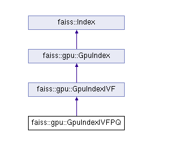

#Gpu IVF PQ
将从 cpu_ivfpq_copy_to_gpu入手分析 GpuIVFPQ结构



```
/// IVFPQ index for the GPU
class GpuIndexIVFPQ : public GpuIndexIVF {
  private:
  GpuIndexIVFPQConfig ivfpqConfig_;

  /// Number of sub-quantizers per encoded vector
  int subQuantizers_;

  /// Bits per sub-quantizer code
  int bitsPerCode_;

  /// Desired inverted list memory reservation
  size_t reserveMemoryVecs_;

  /// The product quantizer instance that we own; contains the
  /// inverted lists
  IVFPQ* index_;
}
```

## index_cpu_to_gpu
### 函数定义
```
faiss::Index * index_cpu_to_gpu(
       GpuResources* resources, int device,
       const faiss::Index *index,
       const GpuClonerOptions *options)
{
    GpuClonerOptions defaults;
    ToGpuCloner cl(resources, device, options ? *options : defaults);
    return cl.clone_Index(index);
}
```
### GpuClonerOptions 默认参数
```
GpuClonerOptions::GpuClonerOptions()
    : indicesOptions(INDICES_64_BIT),   //int64
      useFloat16CoarseQuantizer(false), 
      useFloat16(false), 
      usePrecomputed(true),       // 预计算
      reserveVecs(0),             //定长生成数组 不预留空闲空间！！！
      storeTransposed(false),
      verbose(false) {
}
```

### clone 执行函数段

```
 Index *clone_Index(const Index *index) override {
   ----------------
    else if(auto ipq = dynamic_cast<const faiss::IndexIVFPQ *>(index)) {
            if(verbose)
                printf("  IndexIVFPQ size %ld -> GpuIndexIVFPQ "
                       "indicesOptions=%d "
                       "usePrecomputed=%d useFloat16=%d reserveVecs=%ld\n",
                       ipq->ntotal, indicesOptions, usePrecomputed,
                       useFloat16, reserveVecs);
            GpuIndexIVFPQConfig config;
            config.device = device;
            config.indicesOptions = indicesOptions;
            config.flatConfig.useFloat16 = useFloat16CoarseQuantizer;
            config.flatConfig.storeTransposed = storeTransposed;
            config.useFloat16LookupTables = useFloat16;
            config.usePrecomputedTables = usePrecomputed;

            //实际拷贝动作
            GpuIndexIVFPQ *res = new GpuIndexIVFPQ(resources, ipq, config);

            //不储备内存
            if(reserveVecs > 0 && ipq->ntotal == 0) {
                res->reserveMemory(reserveVecs);
            }

            return res;
        }
   ----------------
 }
```

### GpuIndexIVF 构造函数
```
GpuIndexIVFPQ::GpuIndexIVFPQ(GpuResources* resources,
                             const faiss::IndexIVFPQ* index,
                             GpuIndexIVFPQConfig config) :
    GpuIndexIVF(resources,
                index->d,
                index->metric_type,
                index->nlist,
                config),
    ivfpqConfig_(config),
    subQuantizers_(0),
    bitsPerCode_(0),
    reserveMemoryVecs_(0),
    index_(nullptr) {
#ifndef FAISS_USE_FLOAT16
  FAISS_ASSERT(!ivfpqConfig_.useFloat16LookupTables);
#endif
  // copy 执行函数
  copyFrom(index);
}
```
###  GpuIndexIVFPQ::copyFrom
```
void
GpuIndexIVFPQ::copyFrom(const faiss::IndexIVFPQ* index) {
  DeviceScope scope(device_);

  // IVFPQ只支持 L2距离比较 不支持向量内积累
  // FIXME: support this
  FAISS_THROW_IF_NOT_MSG(index->metric_type == faiss::METRIC_L2,
                     "inner product unsupported");
  //拷贝倒排文件
  GpuIndexIVF::copyFrom(index);

  // Clear out our old data
  delete index_;
  index_ = nullptr;

  subQuantizers_ = index->pq.M;
  bitsPerCode_ = index->pq.nbits;

  // We only support this
  FAISS_ASSERT(index->pq.byte_per_idx == 1);
  FAISS_ASSERT(index->by_residual);
  FAISS_ASSERT(index->polysemous_ht == 0);

  verifySettings_();

  // The other index might not be trained
  if (!index->is_trained) {
    return;
  }

  // Otherwise, we can populate ourselves from the other index
  this->is_trained = true;

  // Copy our lists as well
  // The product quantizer must have data in it
  FAISS_ASSERT(index->pq.centroids.size() > 0);
  //拷贝训练后的PQ中心数据
  index_ = new IVFPQ(resources_,
                     quantizer_->getGpuData(),
                     subQuantizers_,
                     bitsPerCode_,
                     (float*) index->pq.centroids.data(),
                     ivfpqConfig_.indicesOptions,
                     ivfpqConfig_.useFloat16LookupTables,
                     memorySpace_);
  // Doesn't make sense to reserve memory here
  //残差列表预先计算
  index_->setPrecomputedCodes(ivfpqConfig_.usePrecomputedTables);

  //ids -> pqcodes 拷贝
  // Copy database vectors, if any
  const InvertedLists *ivf = index->invlists;
  size_t nlist = ivf ? ivf->nlist : 0;
  for (size_t i = 0; i < nlist; ++i) {
    size_t list_size = ivf->list_size(i);

    // GPU index can only support max int entries per list
    FAISS_THROW_IF_NOT_FMT(list_size <=
                       (size_t) std::numeric_limits<int>::max(),
                       "GPU inverted list can only support "
                       "%zu entries; %zu found",
                       (size_t) std::numeric_limits<int>::max(),
                       list_size);

    index_->addCodeVectorsFromCpu(
                       i, ivf->get_codes(i), ivf->get_ids(i), list_size);
  }
}
```
## 倒排文件拷贝
```
GpuIndexIVF::copyFrom(index)
```
```
GpuIndexIVF::copyFrom(const faiss::IndexIVF* index) {
  DeviceScope scope(device_);
  
  //参数拷贝校验
  this->d = index->d;
  this->metric_type = index->metric_type;

  FAISS_ASSERT(index->nlist > 0);
  FAISS_THROW_IF_NOT_FMT(index->nlist <=
                     (faiss::Index::idx_t) std::numeric_limits<int>::max(),
                     "GPU index only supports %zu inverted lists",
                     (size_t) std::numeric_limits<int>::max());
  nlist_ = index->nlist;

  FAISS_THROW_IF_NOT_FMT(index->nprobe > 0 &&
                         index->nprobe <= getMaxKSelection(),
                         "GPU index only supports nprobe <= %zu; passed %zu",
                         (size_t) getMaxKSelection(),
                         index->nprobe);
  nprobe_ = index->nprobe;

  // The metric type may have changed as well, so we might have to
  // change our quantizer
  //重置量化器
  delete quantizer_;
  quantizer_ = nullptr;

  // Construct an empty quantizer
  GpuIndexFlatConfig config = ivfConfig_.flatConfig;
  // FIXME: inherit our same device
  config.device = device_;

  //ivfpq 必走L2分支
  if (index->metric_type == faiss::METRIC_L2) {
    // FIXME: 2 different float16 options?
    quantizer_ = new GpuIndexFlatL2(resources_, this->d, config);
  } else if (index->metric_type == faiss::METRIC_INNER_PRODUCT) {
    // FIXME: 2 different float16 options?
    quantizer_ = new GpuIndexFlatIP(resources_, this->d, config);
  } else {
    // unknown metric type
    FAISS_ASSERT(false);
  }

  if (!index->is_trained) {
    this->is_trained = false;
    this->ntotal = 0;
    return;
  }

  // Otherwise, we can populate ourselves from the other index
  this->is_trained = true;

  // ntotal can exceed max int, but the number of vectors per inverted
  // list cannot exceed this. We check this in the subclasses.
  this->ntotal = index->ntotal;

  // Since we're trained, the quantizer must have data
  FAISS_ASSERT(index->quantizer->ntotal > 0);

  //倒排列表拷贝
  if (index->metric_type == faiss::METRIC_L2) {
    auto q = dynamic_cast<faiss::IndexFlatL2*>(index->quantizer);
    FAISS_ASSERT(q);

    quantizer_->copyFrom(q);
  } else if (index->metric_type == faiss::METRIC_INNER_PRODUCT) {
    auto q = dynamic_cast<faiss::IndexFlatIP*>(index->quantizer);
    FAISS_ASSERT(q);

    quantizer_->copyFrom(q);
  } else {
    // unknown metric type
    FAISS_ASSERT(false);
  }
}
```

### 倒排列表拷贝
```
void
GpuIndexFlat::copyFrom(const faiss::IndexFlat* index) {
  DeviceScope scope(device_);

  this->d = index->d;
  this->metric_type = index->metric_type;

  //申请GPU显存
  delete data_;
  data_ = new FlatIndex(resources_,
                        this->d,
                        index->metric_type == faiss::METRIC_L2,
                        config_.useFloat16,
                        config_.useFloat16Accumulator,
                        config_.storeTransposed,
                        memorySpace_);

  // The index could be empty
  if (index->ntotal > 0) {
    data_->add(index->xb.data(),
               index->ntotal,
               resources_->getDefaultStream(device_));
  }
}
```
```
FlatIndex::add(const float* data, int numVecs, cudaStream_t stream) {
  if (numVecs == 0) {
    return;
  }

  num_ += numVecs;
  //n*m 矩阵拷贝拷贝 nlist 1024 向量维度 256 则 矩阵大小为 1024 * 256
  DeviceTensor<float, 2, true> vectors(
    (float*) rawData_.data(), {(int) num_, dim_}, space_);
  vectors_ = std::move(vectors);

  //计算倒排中心L2值 nlist 1024 则改向量大小为 1024 float
  //倒排入口 L2 计算公式为 ||c||^2 - 2qc + ||q||^2 提前计算 ||c||^2 减少计算量
  DeviceTensor<float, 1, true> norms({(int) num_}, space_);
  runL2Norm(vectors_, norms, true, stream);
  norms_ = std::move(norms);
}
```
##PQ 中心拷贝
```
  index_ = new IVFPQ(resources_,
                     quantizer_->getGpuData(),
                     subQuantizers_,
                     bitsPerCode_,
                     (float*) index->pq.centroids.data(),
                     ivfpqConfig_.indicesOptions,
                     ivfpqConfig_.useFloat16LookupTables,
                     memorySpace_);
```
### IVFPQ构造函数
```
IVFPQ::IVFPQ(GpuResources* resources,
             FlatIndex* quantizer,
             int numSubQuantizers,
             int bitsPerSubQuantizer,
             float* pqCentroidData,
             IndicesOptions indicesOptions,
             bool useFloat16LookupTables,
             MemorySpace space) :
    IVFBase(resources,
            quantizer,
            numSubQuantizers,
            indicesOptions,
            space),
    numSubQuantizers_(numSubQuantizers),
    bitsPerSubQuantizer_(bitsPerSubQuantizer),
    numSubQuantizerCodes_(utils::pow2(bitsPerSubQuantizer_)),
    dimPerSubQuantizer_(dim_ / numSubQuantizers),
    precomputedCodes_(false),
    useFloat16LookupTables_(useFloat16LookupTables) {
  FAISS_ASSERT(pqCentroidData);

  FAISS_ASSERT(bitsPerSubQuantizer_ <= 8);
  FAISS_ASSERT(dim_ % numSubQuantizers_ == 0);
  FAISS_ASSERT(isSupportedPQCodeLength(bytesPerVector_));

#ifndef FAISS_USE_FLOAT16
  FAISS_ASSERT(!useFloat16LookupTables_);
#endif

  setPQCentroids_(pqCentroidData);
}
```
```
void
IVFPQ::setPQCentroids_(float* data) {
  //计算PQ 中心长度
  size_t pqSize =
    numSubQuantizers_ * numSubQuantizerCodes_ * dimPerSubQuantizer_;

  //data 拷贝到 主机 thrust::host_vector内存中
  // Make sure the data is on the host
  // FIXME: why are we doing this?
  thrust::host_vector<float> hostMemory;
  hostMemory.insert(hostMemory.end(), data, data + pqSize);

  //中心数据拷贝到显存中 使用3维矩阵保存 
  HostTensor<float, 3, true> pqHost(
    hostMemory.data(),
    {numSubQuantizers_, numSubQuantizerCodes_, dimPerSubQuantizer_});
  DeviceTensor<float, 3, true> pqDevice(
    pqHost,
    resources_->getDefaultStreamCurrentDevice());

  //低2维度转置 8 × 32 × 256 -> 8 × 256 × 32
  DeviceTensor<float, 3, true> pqDeviceTranspose(
    {numSubQuantizers_, dimPerSubQuantizer_, numSubQuantizerCodes_});
  runTransposeAny(pqDevice, 1, 2, pqDeviceTranspose,
                  resources_->getDefaultStreamCurrentDevice());

  pqCentroidsInnermostCode_ = std::move(pqDeviceTranspose);
  
  //保存 PQ 中心数据
  // Also maintain the PQ centroids in the form
  // (sub q)(code id)(sub dim)
  DeviceTensor<float, 3, true> pqCentroidsMiddleCode(
    {numSubQuantizers_, numSubQuantizerCodes_, dimPerSubQuantizer_});
  runTransposeAny(pqCentroidsInnermostCode_, 1, 2, pqCentroidsMiddleCode,
                  resources_->getDefaultStreamCurrentDevice());

  pqCentroidsMiddleCode_ = std::move(pqCentroidsMiddleCode);
}
```
```
例：
nilist = 1024 倒排文件列表
numSubQuantizers = 8 
dim = 256 维
numSubQuantizers = 8 PQ切割份数
则：
numSubQuantizers_ = 8
numSubQuantizerCodes_ = 2^8 = 256
dimPerSubQuantizer_ = 256/8 = 32

PQ 中心数据为 8 × 32 × 256 folat 的三维矩阵
显存消耗：
PQ矩阵 + PQ转置矩阵 
8 × 256 × 32 × 32 bytes + 8 × 32 × 256 × 32 bytes = 4M
```
## 预计算残差
```
index_->setPrecomputedCodes(ivfpqConfig_.usePrecomputedTables);
```
### 此段 GPU代码极其晦涩参考CPU版本代码(尤其矩阵转置动作未明白)
```
在外部特征向量查询时与目标向量的L2计算公式为
d = || x - y_C - y_R ||^2
x 是查询向量
y_C 是离X最近的粗聚类中心点,
y_R 是x 的残差量化的聚类中心点

d = || x - y_C ||^2 + || y_R ||^2 + 2 * (y_C|y_R) - 2 * (x|y_R)
    ---------------   ---------------------------       -------
       term 1                 term 2                   term 3
其中 term2 段与输入无关 可预计算
  //
  //    d = || x - y_C ||^2 + || y_R ||^2 + 2 * (y_C|y_R) - 2 * (x|y_R)
  //        ---------------   ---------------------------       -------
  //            term 1                 term 2                   term 3
  //

  // Terms 1 and 3 are available only at query time. We compute term 2
```
### || y_R ||^2 计算
```
pq.M     为向量切割份数
pq.ksub  为残差向量中心数
则生产 M × ksub 结果 e.g.. M = 8 ksub = 256 则生成 8*256  || y_R ||^2
    // squared norms of the PQ centroids
    std::vector<float> r_norms (pq.M * pq.ksub, NAN);
    //遍历每一份切割
    for (int m = 0; m < pq.M; m++)
        //遍历聚类中心
        for (int j = 0; j < pq.ksub; j++)
            r_norms [m * pq.ksub + j] =
                fvec_norm_L2sqr (pq.get_centroids (m, j), pq.dsub);
```
### 计算 2 * (y_C|y_R)
```
pq.M     为向量切割份数
pq.ksub  为残差向量中心数
nlist    为倒排入口数目
precomputed_table 大小为 nlist * pq.M * pq.ksub folat

precomputed_table.resize (nlist * pq.M * pq.ksub);
std::vector<float> centroid (d);

for (size_t i = 0; i < nlist; i++) {
    quantizer->reconstruct (i, centroid.data());

    float *tab = &precomputed_table[i * pq.M * pq.ksub];
    pq.compute_inner_prod_table (centroid.data(), tab);
    fvec_madd (pq.M * pq.ksub, r_norms.data(), 2.0, tab, tab);
}
```
## 拷贝 codes 和 ids
```
 // Copy database vectors, if any
  const InvertedLists *ivf = index->invlists;
  size_t nlist = ivf ? ivf->nlist : 0;
  // 遍历倒排ivf拷贝 ids codes
  for (size_t i = 0; i < nlist; ++i) {
    size_t list_size = ivf->list_size(i);

    // GPU index can only support max int entries per list
    FAISS_THROW_IF_NOT_FMT(list_size <=
                       (size_t) std::numeric_limits<int>::max(),
                       "GPU inverted list can only support "
                       "%zu entries; %zu found",
                       (size_t) std::numeric_limits<int>::max(),
                       list_size);

    index_->addCodeVectorsFromCpu(
                       i, ivf->get_codes(i), ivf->get_ids(i), list_size);
  }
```
### 数据结构
ids codes 均用 char类型存储
```
  /// Device memory for each separate list, as managed by the host.
  /// Device memory as stored in DeviceVector is stored as unique_ptr
  /// since deviceListSummary_ pointers must remain valid despite
  /// resizing of deviceLists_
  std::vector<std::unique_ptr<DeviceVector<unsigned char>>> deviceListData_;
  std::vector<std::unique_ptr<DeviceVector<unsigned char>>> deviceListIndices_;
```

