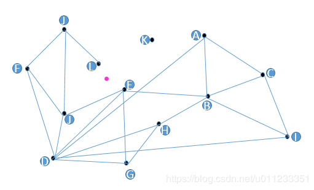
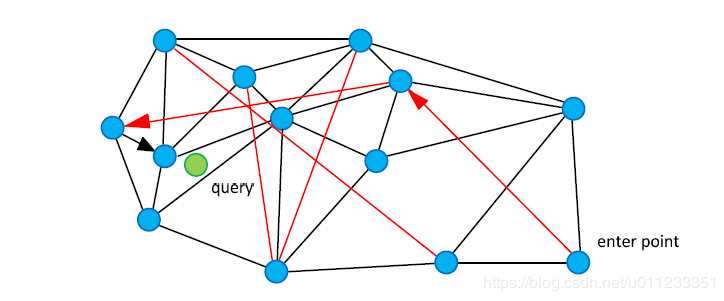
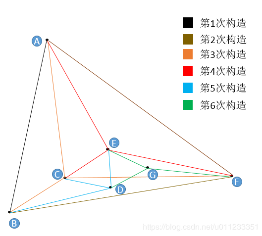
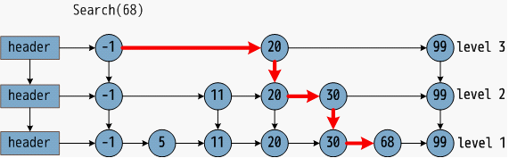
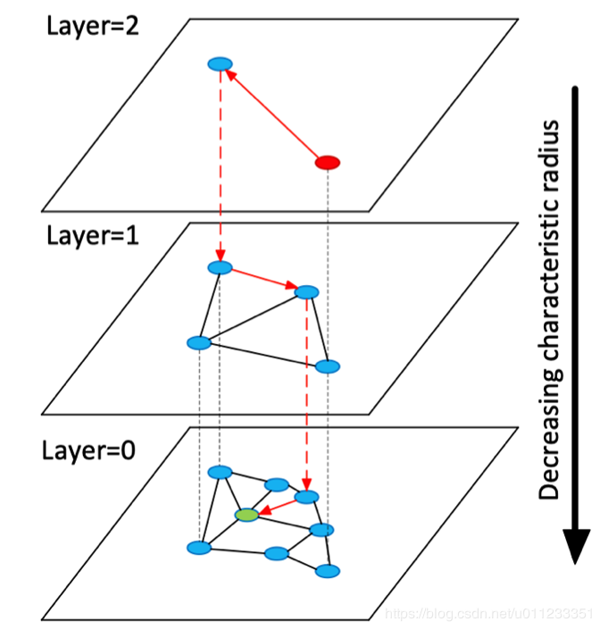

# 朴素想法 

 

        请大家把目光投向上面这张图。假设我们现在有13个2维数据向量，我们把这些向量放在了一个平面直角坐标系内，隐去坐标系刻度，它们的位置关系如上图所示。

         朴素查找法：不少人脑子里都冒出过这样的朴素想法，把某些点和点之间连上线，构成一个查找图，存下来备用；当我想查找与粉色点最近的一点时，我从任意一个黑色点出发，计算它和粉色点的距离，与这个任意黑色点有连接关系的点我们称之为“友点”（直译），然后我要计算这个黑色点的所有“友点”与粉色点的距离，从所有“友点”中选出与粉色点最近的一个点，把这个点作为下一个进入点，继续按照上面的步骤查找下去。如果当前黑色点对粉色点的距离比所有“友点”都近，终止查找，这个黑色点就是我们要找的离粉色点最近的点。

        如果你没看懂上面的文字描述，我们来举个例子。目标：我们要查找与粉色点最近的点。步骤：从任意一个黑色点出发，这里我们随便选个C点吧，计算一下C点和粉色点的距离，存下来备用，再计算C点的所有友点（A，I，B）与粉色点的距离（计算距离和度量的方式有多种，这里我们采用欧氏距离，就是二维物理空间上的“近和远”），我们计算得出B与粉色点的距离最近，而且B点距离粉色点的距离比C点距离粉色点的距离（前面算过）更近，所以我们下面用B点继续查找。B点距离粉色点的距离保存下来，B点的友点是E，A，C，I，H，分别计算它们与粉色点的距离，得到E点与粉色点距离最近，且E点比B点距离粉色点还要近，所以我们选择E点作为下一个查找点。E点的友点是J，B，D，G，这时我们发现J点的与粉色点的距离最近，但是，but，however，J点的距离粉色点的距离比E点还要远，所以满足了终止查找的条件，因此我们返回E点。

       朴素想法之所以叫朴素想法就是因为它的缺点非常多。首先，我们发现图中的K点是无法被查询到的，因为K点没有友点，怎么办？。其次，如果我们要查找距离粉色点最近的两个点，而这两个近点之间如果没有连线，那么将大大影响效率（比如L和E点，如果L和E有连线，那么我们可以轻易用上述方法查出距离粉色点最近的两个点），怎么办？。最后一个大问题，D点真的需要这么多“友点”吗？谁是谁的友点应该怎么确定呢？

       关于K点的问题，我们规定在构图时所有数据向量节点都必须有友点。关于L和E的问题，我们规定在构图时所有距离相近（相似）到一定程度的向量必须互为友点。关于D点问题，权衡构造这张图的时间复杂度，我们规定尽量减少每个节点的“友点”数量。带着这三条规定，我们进入下一章节。

# NSW算法
       在图论中有一个很好的剖分法则专门解决上一节中提到的朴素想法的缺陷问题------德劳内（Delaunay）三角剖分算法，这个算法可以达成如下要求：1，图中每个点都有“友点”。2，相近的点都互为“友点”。3，图中所有连接（线段）的数量最少。效果如下图。
 

       但NSW没有采用德劳内三角剖分法来构成德劳内三角网图，原因之一是德劳内三角剖分构图算法时间复杂度太高，换句话说，构图太耗时。原因之二是德劳内三角形的查找效率并不一定最高，如果初始点和查找点距离很远的话我们需要进行多次跳转才能查到其临近点，需要“高速公路”机制（Expressway mechanism, 这里指部分远点之间拥有线段连接，以便于快速查找）。在理想状态下，我们的算法不仅要满足上面三条需求，还要算法复杂度低，同时配有高速公路机制的构图法。
 

       NSW论文中配了这样一张图，黑色是近邻点的连线，红色线就是“高速公路机制”了。我们从enter point点进入查找，查找绿色点临近节点的时候，就可以用过红色连线“高速公路机制”快速查找到结果。

       NSW朴素构图算法在这里：向图中逐个插入点，插图一个全新点时，通过朴素想法中的朴素查找法（通过计算“友点”和待插入点的距离来判断下一个进入点是哪个点）查找到与这个全新点最近的m个点（m由用户设置），连接全新点到m个点的连线。完了。

       在上面这个戛然而止的算法描述中有些读者肯定会问，就这么简单？对，就这么简单。我们来理智地分析一下这个算法。首先，我们的构图算法是逐点随机插入的，这就意味着在图构建的早期，很有可能构建出“高速公路”。假设我们现在要构成10000个点组成的图，设置m=4（每个点至少有4个“友点”），这10000个点中有两个点，p和q，他们俩坐标完全一样。假设在插入过程中我们分别在第10次插入p，在第9999次插入q，请问p和q谁更容易具有“高速公路”？答：因为在第10次插入时，只见过前9个点，故只能在前9个点中选出距离最近的4个点（m=4）作为“友点”，而q的选择就多了，前9998个点都能选，所以q的“友点”更接近q，p的早期“友点”不一定接近p，所以p更容易具有“高速公路”。结论：一个点，越早插入就越容易形成与之相关的“高速公路”连接，越晚插入就越难形成与之相关的“高速公路”连接。所以这个算法设计的妙处就在于扔掉德劳内三角构图法，改用“无脑添加”（NSW朴素插入算法），降低了构图算法时间复杂度的同时还带来了数量有限的“高速公路”，加速了查找。

      下面对NSM朴素构图算法的过程举例，已经看懂上面文字描述的读者可以跳过下一段。
 

        我们对7个二维点进行构图，用户设置m=3（每个点在插入时找3个紧邻友点）。首先初始点是A点（随机出来的），A点插入图中只有它自己，所以无法挑选“友点”。然后是B点，B点只有A点可选，所以连接BA，此为第1次构造。然后插入F点，F只有A和B可以选，所以连接FA，FB，此为第2此构造。然后插入了C点，同样地，C点只有A，B，F可选，连接CA，CB，CF，此为第3次构造。重点来了，然后插入了E点，E点在A，B，F，C中只能选择3个点（m=3）作为“友点”，根据我们前面讲规则，要选最近的三个，怎么确定最近呢？朴素查找！从A，B，C，F任意一点出发，计算出发点与E的距离和出发点的所有“友点”和E的距离，选出最近的一点作为新的出发点，如果选出的点就是出发点本身，那么看我们的m等于几，如果不够数，就继续找第二近的点或者第三近的点，本着不找重复点的原则，直到找到3个近点为止。由此，我们找到了E的三个近点，连接EA，EC，EF，此为第四次构造。第5次构造和第6次与E点的插入一模一样，都是在“现成”的图中查找到3个最近的节点作为“友点”，并做连接。

        图画完了，请关注E点和A点的连线，如果我再这个图的基础上再插入6个点，这6个点有3个和E很近，有3个和A很近，那么距离E最近的3个点中没有A，距离A最近的3个点中也没有E，但因为A和E是构图早期添加的点，A和E有了连线，我们管这种连线叫“高速公路”，在查找时可以提高查找效率（当进入点为E，待查找距离A很近时，我们可以通过AE连线从E直接到达A，而不是一小步一小步分多次跳转到A）。

       关于NSW算法的朴素构思就讲到这里了，下面我们来说说优化。

      一.在查找的过程中，为了提高效率，我们可以建立一个废弃列表，在一次查找任务中遍历过的点不再遍历。在一次查找中，已经计算过这个点的所有友点距离查找点的距离，并且已经知道正确的跳转方向了，这些结果是唯一的，没有必要再去做走这个路径，因为这个路径会带给我们同样的重复结果，没有意义。

      二.在查找过程中，为了提高准确度，我们可以建立一个动态列表，把距离查找点最近的n个点存储在表中，并行地对这n个点进行同时计算“友点”和待查找点的距离，在这些“友点”中选择n个点与动态列中的n个点进行并集操作，在并集中选出n个最近的友点，更新动态列表。

      注意，插入过程之前会先进行查找，所以优化查找过程就是在优化插入过程。以下给出NSW查找步骤。设待查找q点的m个近邻点。

      1.随机选一个点作为初始进入点，建立空废弃表g和动态列表c，g是变长的列表，c是定长为s的列表（s>m）,将初始点放入动态列表c（附上初始点和待查找q的距离信息），制作动态列表的影子列表c'。

      2.对动态列表c中的所有点并行找出其“友点”，查看这些“友点”是否存储在废弃表g中，如果存在，则丢弃，如不存在，将这些   剩余“友点”记录在废弃列表g中（以免后续重复查找，走冤枉路）。

      3.并行计算这些剩余“友点”距离待查找点q的距离，将这些点及其各自的距离信息放入c。

      4.对动态列表c去重，然后按距离排序（升序），储存前s个点及其距离信息。

      5.查看动态列表c和c'是否一样，如果一样，结束本次查找，返回动态列表中前m个结果。如果不一样，将c'的内容更新为c的    内容，执行第2步。

         插入算法更简单了，插入算法就是先用查找算法查找到m个（用户设置）与待插入点最近的点，连接它们，完了。
# 跳表结构
          设有有序链表，名叫sorted_link，里面有n个节点，每个节点是一个整数。我们从表头开始查找，查找第t（0<t<n）个节点      需要跳转几次？答：t-1次（没错，我是从1开始数的）。把n个节点分成n次查找的需求，都查找一遍，需要跳转几次？答：          （0+1+2+3+.....+（n-1））次。

如果我这链表长成下图这样呢？
 

        这已经不是一个有序链表了，这是三个有序链表+分层连接指针构成的跳表了。看这张示意图就能明白它的查找过程，先查第一层，然后查第二层，然后查第三层，然后找到结果。如果把上段所描述的名字叫sorted_link的链表建立成这样的跳表，那么把sorted_link中的所有元素都查一遍还需要花费（0+1+2+3+.....+（n-1））次吗？当然不需要。那么具体是多少次呢？如果你真的关心，请搜狗搜索关键词“跳表”。

        跳表怎么构建呢？三个字，抛硬币。对于sorted_link链表中的每个节点进行抛硬币，如抛正，则该节点进入上一层有序链 表，每个sorted_link中的节点有50%的概率进入上一层有序链表。将上一层有序链表中和sorted_link链表中相同的元素做一一对应的指针链接。再从sorted_link上一层链表中再抛硬币，sorted_link上一层链表中的节点有50%的可能进入最表层，相当于sorted_link中的每个节点有25%的概率进入最表层。以此类推。

        这样就保证了表层是“高速通道”，底层是精细查找，这个思想被应用到了NSW算法中，变成了其升级版-----HNSW。

# HNSW算法
论文中的一张示意图即可看懂作者malkov的意思。
 

          第0层中，是数据集中的所有点，你需要设置一个常数ml，通过公式floor(-ln(uniform(0,1)) x ml)来计算这个点可以深入到第几层。公式中x是乘号，floor（）的含义是向下取整，uniform（0,1）的含义是在均匀分布中随机取出一个值，ln（）表示取对数。对于上述三个函数有任何疑问的同学请下载搜狗搜索app，搜一下，什么都有。没事看看信息流，骂骂小编，苏福。

          到此，关于HNSW算法的描述就基本结束了。我们来大致梳理一下它的查找过程，从表层（上图中编号为Layer=2）任意点开始查找，选择进入点最邻近的一些友点，把它们存储在定长的动态列表中，别忘了把它们也同样在废弃表中存一份，以防后面走冤枉路。一般地，在第x次查找时，先计算动态列表中所有点的友点距离待查找点（上图绿色点）的距离，在废弃列表中记录过的友点不要计算，计算完后更新废弃列表，不走冤枉路，再把这些计算完的友点存入动态列表，去重排序，保留前k个点，看看这k个点和更新前的k个点是不是一样的，如果不是一样的，继续查找，如果是一样的，返回前m个结果。

         插入构图的时候，先计算这个点可以深入到第几层，在每层的NSW图中查找t个最紧邻点，分别连接它们，对每层图都进行如此操作，描述完毕。

         我们需要控制一大堆参数，首先，插入时的动态列表c的大小，它的大小直接影响了插入效率，和构图的质量，size越大，图的质量越高，构图和查找效率就越低。其次，一个节点至少有几个“友点”，“友点”越多，图的质量越高，查找效率越低。作者在论文中还提到了“max友点连接数”这个参数，设置一个节点至多有多少友点，来提高查找效率，但是设的太小又会影响图的质量，权衡着来。上一段中的ml也是你来控制的，设置的大了，层数就少，内存消耗少，但严重影响效率，太大了会严重消耗内存和构图时间。在论文中，作者将查找状态下的动态列表长度和插入状态下的动态列表长度做了区分，你可以通过调整他们来实现“精构粗找”或者“精找粗构”。


# 图像检索：OPQ索引与HNSW索引

```
PQ VS HNSW比较可以参考如下文章
http://yongyuan.name/blog/opq-and-hnsw.html
```